# Tendeur de filets pour simracing

Deux servos MG90S tirent sur les filets du siège quand la voiture freine ou prend un virage dans Assetto Corsa. SimHub calcule les forces G et envoie deux pourcentages à une Arduino Uno Rev3, équipée d'un shield moteur TB6612/PCA9685 (V2).

Guide interactif complet, avec code à copier : https://claude.ai/artifact/VT9eSiaNRSdstRyenzpKT9

Les prises servo du shield sont reliées directement à D9 et D10 de l'Uno, avec le 5 V et la masse. Les puces PCA9685 et TB6612 servent aux moteurs et ne sont pas utilisées ici : aucune bibliothèque Adafruit n'est nécessaire.

## Fichiers

| Fichier | Rôle |
| --- | --- |
| [`tendeur_filets_uno_r3/tendeur_filets_uno_r3.ino`](tendeur_filets_uno_r3/tendeur_filets_uno_r3.ino) | Programme de l'Uno (bibliothèque Servo, fournie avec Arduino IDE) |
| [`simhub/message_mise_a_jour.js`](simhub/message_mise_a_jour.js) | Formule JavaScript pour SimHub › Custom serial devices › Update messages |
| [`schemas/`](schemas) | Schémas de ce README |

## Matériel

- Arduino Uno Rev3 (A000066)
- Shield moteur Hailege TB6612 / PCA9685 (V2)
- 2 servos MG90S
- Câble USB A-B
- Adaptateur secteur 9 V 1 A, fiche jack 5,5 × 2,1 mm, + au centre (conseillé pour rouler)
- Palonniers des servos, cordelette fine ou fil de pêche tressé, colliers et vis

## Alimentation

1. Les prises servo prennent leur courant sur le 5 V de l'Uno. En USB seul, l'Uno et les deux servos se partagent 500 mA : ça suffit pour tester.
2. Pour rouler, branche l'adaptateur 9 V 1 A sur le jack et garde le câble USB pour les données. L'Uno choisit seul l'adaptateur.
3. Ne branche rien sur les borniers M1 à M4 ni sur le bornier d'alimentation des moteurs.
4. Fil marron sur −, fil orange sur S : vérifie le marquage à côté des prises.

## 1. Installer le programme

1. Installe Arduino IDE 2.
2. Branche l'Uno seule au PC avec le câble USB.
3. Choisis **Outils › Carte › Arduino AVR Boards › Arduino Uno**, puis le port **Arduino Uno (COMx)**.
4. Ouvre `tendeur_filets_uno_r3.ino` et clique sur **Téléverser**. Note le numéro du port COM.

## 2. Montage

| Élément | Où | Remarque |
| --- | --- | --- |
| Shield | Enfiché sur l'Uno | Toutes les broches dans les connecteurs |
| Servo gauche | Prise SERVO 1 | Marron sur − |
| Servo droit | Prise SERVO 2 | Marron sur − |
| Câble USB | Uno → PC | Données SimHub |
| Adaptateur 9 V | Jack de l'Uno | Courant des servos pendant le jeu |
| Borniers M1–M4 et alim moteurs | Rien | Inutiles ici |

Une prise est reliée à D10, l'autre à D9, et l'ordre change selon les fabricants. Le test de l'étape suivante montre si les servos sont inversés.

## 3. Régler la course des servos

1. Uno branchée : les servos sont au repos. Monte les palonniers dans cette position, cordelette juste tendue.
2. Ouvre le Moniteur série d'Arduino IDE, à 115200 bauds, fin de ligne **Nouvelle ligne**.
3. Envoie `L100R100` : les deux filets se tendent une seconde puis reviennent au repos (sécurité normale).
4. Envoie `L100R0` : seul le filet gauche doit bouger. Sinon, échange les deux prises servo.
5. Ajuste `GAUCHE_REPOS`, `GAUCHE_MAX`, `DROIT_REPOS` et `DROIT_MAX` dans le programme, puis téléverse à nouveau. Si un servo tourne dans le mauvais sens, échange ses valeurs `REPOS` et `MAX`.
6. Ferme le Moniteur série avant de lancer SimHub.

## 4. Configurer SimHub

1. Choisis **Assetto Corsa** comme jeu.
2. **Add/remove features** › coche **Custom serial devices**.
3. **Custom serial devices** › **Add new serial device**, port de l'Uno, **115200** bauds, active l'appareil.
4. **Update messages** › **Add new message** › coche **Use JavaScript** et colle `simhub/message_mise_a_jour.js`.
5. Dans **Available properties**, regarde `AccelerationSurge` pendant un gros freinage : vers −10 à −30, laisse `UNITE = 9.81` ; vers −1 à −3, mets `UNITE = 1`.

Quand SimHub se connecte, l'Uno redémarre environ deux secondes : c'est normal.

## 5. En piste

| Situation | Filet gauche | Filet droit |
| --- | --- | --- |
| Ligne droite | 0 % | 0 % |
| Gros freinage, 2 G | 100 % | 100 % |
| Virage à droite, 1 G | 50 % | 0 % |
| Freinage 0,5 G en virage à gauche, 1 G | 25 % | 75 % |
| Menu, pause ou jeu fermé | 0 % | 0 % |

Réglages dans SimHub : `G_MAX`, `GAIN_FREINAGE`, `GAIN_VIRAGE`, `GAIN_ACCEL`, `TENSION_BASE`, `INVERSER_VIRAGE`. Réglages dans le programme : `LISSAGE`, `DELAI_SECURITE_MS`.

## Dépannage

| Symptôme | Solution |
| --- | --- |
| L'Uno redémarre ou SimHub se déconnecte quand les filets bougent | Branche l'adaptateur 9 V 1 A sur le jack |
| Téléversement impossible, port occupé | Désactive l'appareil dans SimHub et ferme le Moniteur série |
| Un servo ne bouge pas | Prise à l'envers ou mal enfoncée : marron sur − |
| Le mauvais filet bouge au test `L100R0` | Échange les deux prises servo |
| Le mauvais filet se tend en virage | `INVERSER_VIRAGE = true` dans SimHub |
| Un servo chauffe ou grésille | Rapproche `MAX` de `REPOS` |

## Message série

SimHub envoie `L<0-100>R<0-100>` suivi d'un saut de ligne, à 115200 bauds. Sans message pendant 1 s, les filets se relâchent.
